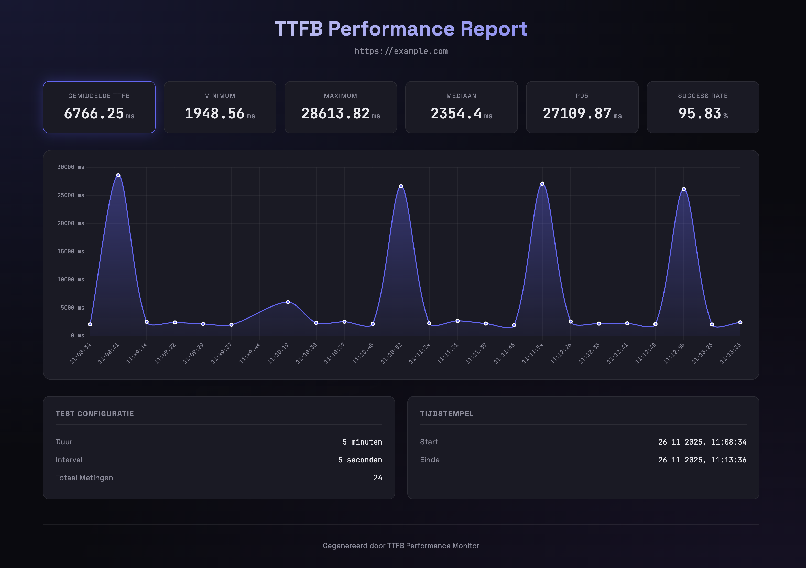

# Perf Probe

A CLI tool to measure **Time To First Byte (TTFB)** for websites over a configurable period and generate beautiful HTML reports with charts.



## Features

-   📊 **Measures TTFB** over time with configurable duration and interval
-   🚀 **Next.js cache detection** - tracks `x-nextjs-cache` header (HIT/STALE/MISS)
-   📈 **Beautiful HTML reports** with Chart.js visualizations
-   📁 **Automatic result storage** - each run saved in separate timestamped folder
-   📉 **Statistics** - Average, Min, Max, Median, P95, Success Rate

## Installation

```bash
# Clone the repository
git clone https://github.com/jesperingels/perf-probe.git
cd perf-probe

# Install dependencies
npm install
```

## Usage

### Basic Test (20 minutes, every 10 seconds)

```bash
npm run test -- --url https://example.com
```

### Quick Test (1 minute)

```bash
npm run test:quick -- --url https://example.com
```

### Custom Configuration

```bash
npm run test -- --url https://example.com --duration 5 --interval 5
```

### Options

| Option       | Description                          | Default |
| ------------ | ------------------------------------ | ------- |
| `--url`      | URL to test (required)               | -       |
| `--duration` | Test duration in minutes             | 20      |
| `--interval` | Interval between requests in seconds | 10      |

## Output

Results are saved in the `results/` folder, organized by timestamp:

```
results/
└── 2025-11-26T10-30-00/
    ├── results.json    # Raw measurement data
    └── report.html     # Visual report (open in browser)
```

### Console Output

```
┌─────────────────────────────────────────────────────────┐
│              TTFB Performance Monitor                   │
└─────────────────────────────────────────────────────────┘

  🌐 URL:      https://example.com
  ⏱️  Duration: 5 minutes
  🔄 Interval: 10 seconds
  📊 Tests:    30 measurements

───────────────────────────────────────────────────────────────────────────
  #     Time          TTFB        Cache       Status
───────────────────────────────────────────────────────────────────────────
    1   10:30:00    245.32 ms   HIT         ✅ 200
    2   10:30:10    251.18 ms   HIT         ✅ 200
    3   10:30:20   1523.45 ms   STALE       ✅ 200
```

### HTML Report

Open `results/{timestamp}/report.html` in your browser to see:

-   Interactive line chart of TTFB over time
-   Statistics cards (Average, Min, Max, Median, P95)
-   Cache status breakdown
-   Test configuration details

## Cache Status Colors

In the chart, data points are colored by cache status:

-   🟢 **Green** = HIT (served from cache)
-   🟡 **Yellow** = STALE (cache expired, being revalidated)
-   🔴 **Red** = MISS (no cache, fresh render)
-   🟣 **Purple** = No cache header

## Use Cases

-   **Performance monitoring** - Track TTFB trends over time
-   **Cache validation** - Verify Next.js ISR/SSG is working correctly
-   **Before/after comparisons** - Measure impact of optimizations
-   **Cold start detection** - Identify serverless cold starts
-   **SLA monitoring** - Ensure TTFB stays within acceptable limits

## Contributing

Contributions are welcome! Please feel free to submit a Pull Request.

## License

MIT
